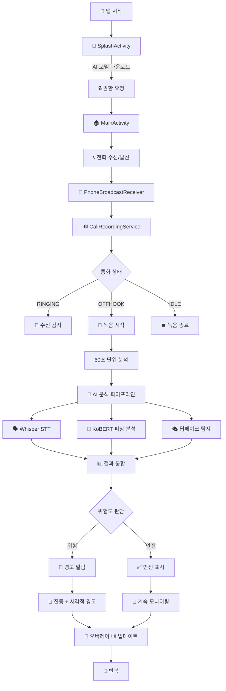
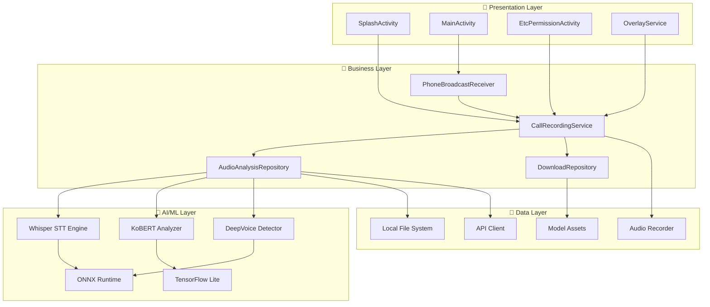

# 🛡️ CallGuard AI - 실시간 피싱 및 딥페이크 음성 탐지 앱

## 📱 개요

CallGuard AI는 통화 중 실시간으로 피싱 시도와 딥페이크(합성) 음성을 탐지하여 사용자를 보호하는 AI 기반 안드로이드 애플리케이션입니다.

### 🎯 주요 기능

- 📞 **실시간 통화 모니터링**: 통화 중 자동으로 음성 녹음 및 분석
- 🧠 **AI 기반 위협 탐지**: Whisper STT + KoBERT + 딥페이크 탐지 모델
- 🚨 **즉시 알림 시스템**: 위험 감지 시 진동 및 시각적 경고
- 🔄 **실시간 오버레이**: 통화 중 플로팅 위젯으로 실시간 상태 표시
- 🌐 **한국어 특화**: KoBERT를 활용한 한국어 피싱 텍스트 분석

---

## 🔄 앱 동작 플로우



---

## 🏗️ 아키텍처 다이어그램



---

## 🛠️ 기술 스택

### 🤖 AI/ML

| 기술                  | 용도              | 버전           |
|---------------------|-----------------|--------------|
| **OpenAI Whisper**  | 음성-텍스트 변환 (STT) | small model  |
| **KoBERT**          | 한국어 피싱 텍스트 분석   | -            |
| **딥페이크 탐지 모델**      | 합성음성 감지         | Custom Model |
| **ONNX Runtime**    | AI 모델 추론        | 1.16.0       |
| **TensorFlow Lite** | 모바일 AI 추론       | 2.16.1       |

### 📱 Android Framework

| 기술                            | 용도           | 버전    |
|-------------------------------|--------------|-------|
| **Kotlin**                    | 주 개발 언어      | 1.9.0 |
| **Jetpack Compose**           | 현대적 UI 프레임워크 | 1.5.0 |
| **Hilt**                      | 의존성 주입       | 2.48  |
| **Coroutines**                | 비동기 처리       | 1.7.3 |
| **MVVM + Clean Architecture** | 아키텍처 패턴      | -     |

### 🔧 Core Features

| 기술                        | 용도                | 버전 |
|---------------------------|-------------------|----|
| **Foreground Service**    | 백그라운드 통화 모니터링     | -  |
| **Accessibility Service** | 통화 상태 감지          | -  |
| **Overlay Window**        | 실시간 플로팅 UI        | -  |
| **Broadcast Receiver**    | 통화 이벤트 수신         | -  |
| **NDK + CMake**           | 네이티브 코드 (Whisper) | -  |

### 🌐 네트워킹 & 통신

| 기술                  | 용도         | 버전     |
|---------------------|------------|--------|
| **Retrofit**        | HTTP 클라이언트 | 2.11.0 |
| **OkHttp**          | 네트워크 인터셉터  | 4.12.0 |
| **RxJava/RxKotlin** | 반응형 프로그래밍  | 2.1.1  |

### 🎨 UI/UX 라이브러리

| 기술                     | 용도           | 버전    |
|------------------------|--------------|-------|
| **FloatingView**       | 드래그 가능한 오버레이 | 1.5   |
| **Pulsator**           | 애니메이션 효과     | 1.0.3 |
| **RollingText**        | 숫자 롤링 애니메이션  | 1.3.0 |
| **RoundedProgressBar** | 진행률 표시       | 3.0.0 |

---

## 📊 AI 모델 성능

### 🎯 탐지 정확도

- **피싱 텍스트 탐지**: KoBERT 기반 95%+ 정확도
- **딥페이크 음성 탐지**: 60% 이상 시 위험 경고
- **실시간 처리**: 60초 단위 분석으로 저지연 구현

### 📈 위험도 기준

| 딥페이크 확률 | 상태    | 알림             |
|---------|-------|----------------|
| 60% 이상  | 🔴 위험 | 강한 진동 + 빨간색 UI |
| 50-59%  | 🟡 주의 | 약한 진동 + 노란색 UI |
| 50% 미만  | 🟢 안전 | 진동 없음 + 초록색 UI |

---

## 🚀 설치 및 실행

### 📋 시스템 요구사항

- **Android**: API 29 (Android 10) 이상
- **RAM**: 최소 4GB 권장
- **저장공간**: 500MB 이상 (AI 모델 포함)
- **권한**: 통화 상태, 오디오 녹음, 오버레이, 접근성 서비스

### 🔧 빌드 방법

1. **저장소 클론**

```bash
git clone https://github.com/your-username/callguard-ai-android.git
cd callguard-ai-android
```

2. **Android Studio에서 프로젝트 열기**

```bash
# Android Studio에서 프로젝트 열기
# 또는 명령줄에서
./gradlew assembleDebug
```

3. **의존성 설치**

```bash
# 자동으로 의존성 다운로드됨
# AI 모델은 앱 첫 실행 시 자동 다운로드
```

4. **APK 설치**

```bash
# 디버그 빌드
./gradlew installDebug

# 릴리즈 빌드
./gradlew assembleRelease
```

---

## 🔐 필요 권한

### 🎯 핵심 권한

```xml
<!-- 통화 상태 감지 -->
<uses-permission android:name="android.permission.READ_PHONE_STATE" />

<!-- 오디오 녹음 -->
<uses-permission android:name="android.permission.RECORD_AUDIO" />

<!-- 오버레이 창 표시 -->
<uses-permission android:name="android.permission.SYSTEM_ALERT_WINDOW" />

<!-- 포그라운드 서비스 -->
<uses-permission android:name="android.permission.FOREGROUND_SERVICE" />

<!-- 네트워크 접근 (모델 다운로드) -->
<uses-permission android:name="android.permission.INTERNET" />

<!-- 파일 시스템 접근 -->
<uses-permission android:name="android.permission.WRITE_EXTERNAL_STORAGE" />
```

### 🔧 설정 방법

1. 앱 설치 후 권한 요청 화면에서 모든 권한 허용
2. 설정 > 접근성 > CallGuard AI 서비스 활성화
3. 설정 > 다른 앱 위에 그리기 > CallGuard AI 허용

---

## 📱 사용 방법

### 1️⃣ 초기 설정

1. 앱 설치 및 실행
2. AI 모델 자동 다운로드 대기 (약 2-3분)
3. 필요 권한 허용
4. 메인 화면에서 "정상작동중" 상태 확인

### 2️⃣ 실시간 모니터링

1. 전화 수신/발신 시 자동으로 모니터링 시작
2. 통화 중 화면에 플로팅 위젯 표시
3. 실시간 위험도 확인 (색상으로 구분)
4. 위험 감지 시 자동 진동 알림

### 3️⃣ 결과 해석

- **🟢 초록색**: 안전한 통화
- **🟡 노란색**: 주의 필요 (딥페이크 의심)
- **🔴 빨간색**: 위험! (피싱 또는 딥페이크 감지)

---

## 🔬 개발 세부사항

### 📁 프로젝트 구조

```
callguard-ai-android/
├── app/                          # 메인 애플리케이션
│   ├── src/main/java/com/museblossom/callguardai/
│   │   ├── presentation/         # UI 레이어 (Activity, Compose)
│   │   ├── domain/              # 비즈니스 로직
│   │   ├── repository/          # 데이터 관리
│   │   ├── util/               # 유틸리티 클래스
│   │   │   ├── audio/          # 오디오 처리
│   │   │   ├── kobert/         # KoBERT 분석기
│   │   │   └── recorder/       # 녹음 관리
│   │   └── di/                 # 의존성 주입
│   └── libs/                    # 외부 라이브러리 (FFmpeg 등)
├── lib/                         # Whisper 네이티브 라이브러리
│   └── src/main/jni/whisper/   # C++ Whisper 구현
├── ggml/                        # GGML 머신러닝 백엔드
└── src/                         # Whisper C++ 소스코드
```


### ⚠️ 현재 제한사항

- Android 10 (API 29) 이상에서만 동작
- 통화 앱별로 녹음 품질 차이 가능
- 네트워크 연결 필요 (모델 다운로드 시)
- 배터리 사용량이 상대적으로 높음


<div align="center">
</div>
