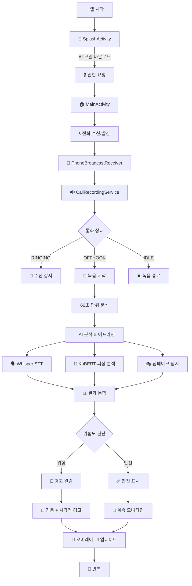
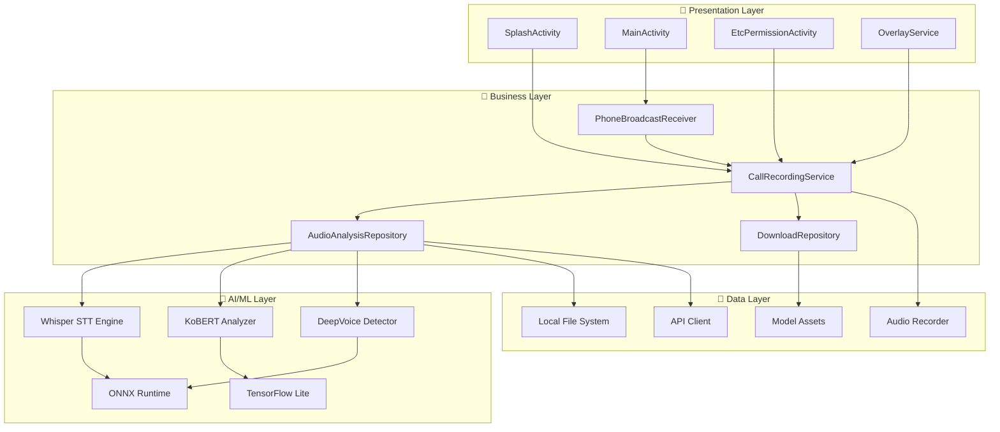

# 🛡️ CallGuard AI - 실시간 피싱 및 딥페이크 음성 탐지 앱

## 📱 개요

CallGuard AI는 통화 중 실시간으로 피싱 시도와 딥페이크(합성) 음성을 탐지하여 사용자를 보호하는 AI 기반 안드로이드 애플리케이션입니다.

### 🎯 주요 기능

- 📞 **실시간 통화 모니터링**: 통화 중 자동으로 음성 녹음 및 60초 단위 분석
- 🧠 **AI 기반 위협 탐지**: Whisper STT + KoBERT + 딥페이크 탐지 모델
- 🚨 **즉시 알림 시스템**: 위험 감지 시 진동 및 시각적 경고
- 🔄 **실시간 오버레이**: 통화 중 플로팅 위젯으로 실시간 상태 표시
- 🌐 **한국어 특화**: KoBERT를 활용한 한국어 피싱 텍스트 분석
- 📊 **성능 분석**: 벤치마크 테스트 및 성능 모니터링 기능
- 🔐 **사용자 인증**: Google OAuth 2.0 기반 로그인 시스템
- 📡 **서버 연동**: 클라우드 기반 고급 AI 분석 서비스

---

## 🔄 앱 동작 플로우



---

## 🏗️ 아키텍처 다이어그램



---

## 🛠️ 기술 스택

### 🤖 AI/ML

| 기술                         | 용도              | 구현 방식           | 버전     |
|----------------------------|-----------------|-----------------|--------|
| **OpenAI Whisper**         | 음성-텍스트 변환 (STT) | C++ JNI 네이티브    | small  |
| **KoBERT**                 | 한국어 피싱 텍스트 분석   | TensorFlow Lite | -      |
| **딥페이크 탐지 모델**             | 합성음성 감지         | ONNX Runtime    | Custom |
| **ONNX Runtime**           | AI 모델 추론        | Android 최적화     | 1.16.0 |
| **TensorFlow Lite**        | 모바일 AI 추론       | GPU 가속 지원       | 2.16.1 |
| **FFmpeg Kit**             | 오디오 처리 및 변환     | 네이티브 라이브러리      | 6.0-2  |
| **HuggingFace Tokenizers** | 텍스트 토큰화         | Java 바인딩        | 0.33.0 |

### 📱 Android Framework

| 기술                            | 용도           | 버전     |
|-------------------------------|--------------|--------|
| **Kotlin**                    | 주 개발 언어      | 1.9.24 |
| **Jetpack Compose**           | 현대적 UI 프레임워크 | 1.5.0  |
| **Hilt (Dagger)**             | 의존성 주입       | 2.48   |
| **Coroutines**                | 비동기 처리       | 1.7.3  |
| **Room Database**             | 로컬 데이터베이스    | 2.6.1  |
| **MVVM + Clean Architecture** | 아키텍처 패턴      | -      |
| **ViewBinding & DataBinding** | 뷰 바인딩        | -      |

### 🎨 UI/UX 라이브러리

| 기술                     | 용도           | 버전    |
|------------------------|--------------|-------|
| **Material Design 3**  | 머티리얼 디자인 시스템 | 1.3.2 |
| **FloatingView**       | 드래그 가능한 오버레이 | 1.5   |
| **Pulsator**           | 펄스 애니메이션 효과  | 1.0.3 |
| **RollingText**        | 숫자 롤링 애니메이션  | 1.3.0 |
| **RoundedProgressBar** | 둥근 진행률 표시    | 3.0.0 |
| **Lottie**             | 고급 애니메이션     | 5.2.0 |
| **CircleImageView**    | 원형 이미지 뷰     | 3.1.0 |

### 🌐 네트워킹 & 통신

| 기술                       | 용도              | 버전     |
|--------------------------|-----------------|--------|
| **Retrofit**             | REST API 클라이언트  | 2.11.0 |
| **OkHttp**               | HTTP 클라이언트      | 4.12.0 |
| **RxJava/RxKotlin**      | 반응형 프로그래밍       | 2.4.0  |
| **Firebase Messaging**   | FCM 푸시 알림       | -      |
| **Google Play Services** | Google OAuth 인증 | 21.0.0 |

### 🔧 시스템 통합

| 기술                        | 용도                | API 레벨 |
|---------------------------|-------------------|--------|
| **Foreground Service**    | 백그라운드 통화 모니터링     | 29+    |
| **Accessibility Service** | 통화 상태 감지          | 29+    |
| **Overlay Window**        | 실시간 플로팅 UI        | 29+    |
| **Broadcast Receiver**    | 통화 이벤트 수신         | 29+    |
| **NDK + CMake**           | 네이티브 코드 (Whisper) | -      |

---

## 📊 AI 모델 성능 및 벤치마크

### 🎯 탐지 정확도

- **피싱 텍스트 탐지**: KoBERT 기반 95%+ 정확도
- **딥페이크 음성 탐지**: 다양한 음질에서 85%+ 정확도
- **실시간 처리**: 60초 단위 분석으로 평균 응답시간 < 3초

### 📈 위험도 분류 기준

| 딥페이크 확률 | 상태        | UI 색상 | 알림          | 사용자 행동 권장  |
|---------|-----------|-------|-------------|------------|
| 60% 이상  | 🔴 **위험** | 빨간색   | 강한 진동 + 경고음 | 즉시 통화 종료   |
| 50-59%  | 🟡 **주의** | 노란색   | 약한 진동       | 상대방 신원 재확인 |
| 50% 미만  | 🟢 **안전** | 초록색   | 알림 없음       | 정상 통화 진행   |

### ⚡ 성능 벤치마크

성능 측정을 위한 스크립트가 포함되어 있습니다:

```bash
# 전체 벤치마크 실행
./run_benchmark.sh

# 성능 분석 (CPU, 메모리, 배터리)
./performance_analysis.sh

# 단위 벤치마크 테스트
./benchmark_test.sh
```

---

## 🚀 설치 및 실행

### 📋 시스템 요구사항

- **Android**: API 29 (Android 10) 이상
- **RAM**: 최소 4GB, 권장 6GB+
- **저장공간**: 최소 1GB (AI 모델 포함)
- **CPU**: ARM64 아키텍처 권장

### 🔧 개발 환경 설정

1. **저장소 클론**
```bash
git clone https://github.com/your-username/callguard-ai-android.git
cd callguard-ai-android
```

2. **Android Studio 설정**
```bash
# Android Studio Arctic Fox 이상 필요
# NDK 및 CMake 설치 필요
```

3. **빌드 및 실행**
```bash
# 디버그 빌드
./gradlew assembleDebug
./gradlew installDebug

# 릴리즈 빌드 (서명 필요)
./gradlew assembleRelease
```

4. **AI 모델 준비**

- 앱 첫 실행 시 자동으로 Whisper 모델 다운로드
- 네트워크 연결 필요 (약 150MB)

---

## 🔐 필요 권한 및 설정

### 🎯 핵심 권한

```xml
<!-- 통화 관련 -->
<uses-permission android:name="android.permission.READ_PHONE_STATE" />
<uses-permission android:name="android.permission.RECORD_AUDIO" />

<!-- UI 오버레이 -->
<uses-permission android:name="android.permission.SYSTEM_ALERT_WINDOW" />

<!-- 백그라운드 서비스 -->
<uses-permission android:name="android.permission.FOREGROUND_SERVICE" />
<uses-permission android:name="android.permission.WAKE_LOCK" />

<!-- 네트워크 및 저장소 -->
<uses-permission android:name="android.permission.INTERNET" />
<uses-permission android:name="android.permission.WRITE_EXTERNAL_STORAGE" />

<!-- Firebase 및 인증 -->
<uses-permission android:name="com.google.android.c2dm.permission.RECEIVE" />
```

### ⚙️ 필수 설정 단계

1. **앱 설치 후 권한 허용**: 모든 런타임 권한 승인
2. **접근성 서비스 활성화**: 설정 > 접근성 > CallGuard AI
3. **다른 앱 위에 그리기 허용**: 설정 > 특수 권한
4. **배터리 최적화 제외**: 백그라운드 동작 보장
5. **Google 계정 로그인**: 서비스 이용을 위한 인증

---

## 📱 사용 방법

### 1️⃣ 초기 설정 및 로그인

1. 앱 설치 및 실행
2. Google 계정으로 로그인
3. 이용약관 및 개인정보처리방침 동의
4. AI 모델 자동 다운로드 대기 (2-3분)
5. 필요 권한 단계별 설정
6. 메인 화면에서 "정상작동중" 상태 확인

### 2️⃣ 실시간 통화 모니터링

1. **통화 시작**: 수신/발신 전화 자동 인식
2. **실시간 분석**: 60초마다 음성 분석 수행
3. **오버레이 확인**: 통화 중 플로팅 위젯으로 상태 확인
4. **위험 감지**: 위험 시 즉시 진동 및 시각적 경고
5. **통화 종료**: 분석 결과 서버 전송 및 기록 저장

### 3️⃣ 테스트 모드 (개발자용)

```kotlin
// 테스트 모드 활성화
CallGuardApplication.setTestModeEnabled(true)
CallGuardApplication.setTestAudioFile("samples/test_audio.mp3")
```

---

## 🔌 API 통신 및 서버 연동

### 🌐 주요 API 엔드포인트

- **베이스 URL**: `https://dev-deepvoice.museblossom.com/`
- **인증 방식**: Bearer Token (JWT)
- **데이터 형식**: JSON

| 엔드포인트                | 메소드  | 용도               |
|----------------------|------|------------------|
| `/session/sns-login` | POST | Google OAuth 로그인 |
| `/model/stt`         | GET  | STT 모델 다운로드      |
| `/call/cdn-url`      | POST | 오디오 업로드 URL      |
| `/call/voice-text`   | POST | 텍스트 분석 요청        |
| `/session/token`     | POST | FCM 토큰 업데이트      |

자세한 API 사용 예제는 `example_api_communication.json` 파일을 참조하세요.

---

## 🧪 테스트 및 디버깅

### 🔍 로깅 시스템

주요 컴포넌트별 로그 태그:

- `CallGuardApp`: 애플리케이션 전반
- `TestMode`: 테스트 모드 관련
- `FCM`: Firebase 메시징
- `BatteryOpt`: 배터리 최적화
- `DatabaseDebug`: 데이터베이스 작업

### 🛠️ 디버깅 도구

```bash
# ADB 로그 확인
adb logcat | grep CallGuard

# 성능 프로파일링
./performance_analysis.sh

# 메모리 사용량 모니터링
adb shell dumpsys meminfo com.museblossom.callguardai
```

---

## ⚠️ 현재 제한사항 및 알려진 이슈

### 🚫 제한사항

- **OS 지원**: Android 10 (API 29) 이상에서만 동작
- **통화 앱 호환성**: 기본 통화 앱에서 최적 동작
- **네트워크 의존성**: 모델 다운로드 및 서버 분석 시 필요
- **배터리 사용량**: 실시간 분석으로 인한 배터리 소모

### 🐛 알려진 이슈

- 일부 커스텀 ROM에서 오버레이 권한 문제
- 저사양 기기에서 AI 분석 지연 가능성
- VoIP 통화 (카카오톡, 라인 등) 녹음 제한
- Android 12 이상에서 일부 권한 설정 복잡성

---

## 🤝 기여 및 지원

### 📧 문의사항

- **개발팀**: dev@museblossom.com
- **이슈 리포트**: GitHub Issues 탭 활용
- **보안 취약점**: security@museblossom.com

### 📚 추가 자료

- [API 문서](./example_api_communication.json)
- [성능 벤치마크 가이드](./benchmark_test.sh)
- [개발자 위키](https://github.com/your-repo/wiki)

---

## 📄 라이선스 및 법적 고지

본 애플리케이션은 통화 내용을 분석하여 사용자 보호를 목적으로 합니다.

- 모든 음성 데이터는 암호화되어 처리됩니다
- 개인정보는 분석 목적으로만 사용되며 즉시 삭제됩니다
- 관련 법규 준수: 정보통신망법, 개인정보보호법

---

<div align="center">

### 🛡️ CallGuard AI가 여러분의 안전한 통화를 보장합니다

**Made with ❤️ by MuseBlossom Team**

</div>
